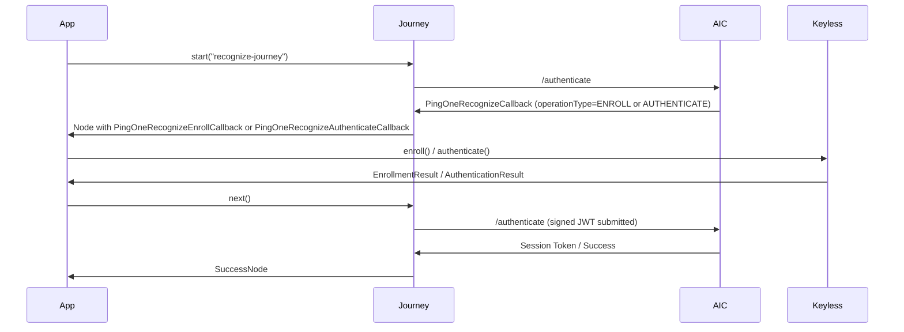

[](https://swift.org)
[](https://developer.apple.com/ios/)
[](../LICENSE)


# PingRecognize

> [!NOTE]
> **This module is a wrapper for the PingOne Recognize biometric SDK (powered by Keyless). Its purpose is to facilitate integration between your application and PingOne services as part of an Advanced Identity Cloud / PingAM Journey. The Recognize service is invoked server-side as a step within the orchestration layer — the business logic for triggering enrollment or authentication resides on the server, so you can update it without releasing a new client build.**

## Getting Started

### Prerequisites

- Ping Advanced Identity Cloud / PingAM [Supported Versions](https://support.pingidentity.com/s/article/Ping-Identity-EOL-Tracker)
- iOS 16.0+
- Swift 6.0+
- Xcode 15+
- A Journey configured with a **PingOne Recognize** node

### Installation

To integrate the module into your iOS project, add the following dependency to your `Package.swift` or `Podfile`.

#### Swift Package Manager

```swift
.package(url: "https://github.com/ForgeRock/ping-ios-sdk.git", from: "<version>")
```

Then add the `PingRecognize` product to your target's dependencies.

#### CocoaPods

```ruby
pod 'PingRecognize', '~> <version>'
pod 'PingJourney',   '~> <version>'
```

Replace `<version>` with the latest version of the SDK.

### Import the Module

```swift
import PingRecognize
```

## Overview

The `PingRecognize` module integrates PingOne Recognize biometric authentication into Journey-based flows on iOS. It handles both **enrollment** (registering a user's biometric) and **authentication** (verifying a returning user) through a single callback returned by the Journey framework.

The `operationType` output field from the server determines which operation is performed:

| `operationType` | Purpose                           |
|-----------------|-----------------------------------|
| `ENROLL`        | Biometric enrollment ceremony     |
| `AUTHENTICATE`  | Biometric authentication ceremony |

All server-supplied configuration (API key, host, liveness settings, etc.) is parsed automatically — **you only need to call `enroll()` or `authenticate()`**.



## Usage

### 1. Create a Journey Instance

```swift
let journey = await Journey.createJourney { config in
    config.module(Oidc) { oidcConfig in
        oidcConfig.clientId = "your-client-id"
        oidcConfig.discoveryEndpoint = "https://openam-your-tenant.forgeblocks.com/am/oauth2/alpha/.well-known/openid-configuration"
        oidcConfig.scopes = ["openid", "profile", "email"]
        oidcConfig.redirectUri = "com.example.app://oauth2redirect"
    }
}
```

### 2. Handle the Recognize Callback

The Journey framework returns either a `PingOneRecognizeEnrollCallback` or a `PingOneRecognizeAuthenticateCallback` depending on the `operationType` set by the server. Each exposes an operation-specific method — `enroll()` or `authenticate()` — that drives the biometric ceremony and returns `Result<RecognizeSuccess, Error>`.

```swift
let node = await journey.start("recognize-journey")
switch node {
case let continueNode as ContinueNode:
    for callback in continueNode.callbacks {
        if let enrollCallback = callback as? PingOneRecognizeEnrollCallback {
            let result = await enrollCallback.enroll()
            switch result {
            case .success:
                await continueNode.next()
            case .failure(let error):
                print("Enrollment failed: \(error.localizedDescription)")
                if let recognizeError = error as? RecognizeError {
                    print("Error code: \(recognizeError.code)")
                }
            }
        } else if let authCallback = callback as? PingOneRecognizeAuthenticateCallback {
            let result = await authCallback.authenticate()
            switch result {
            case .success:
                await continueNode.next()
            case .failure(let error):
                print("Authentication failed: \(error.localizedDescription)")
                if let recognizeError = error as? RecognizeError {
                    print("Error code: \(recognizeError.code)")
                }
            }
        }
    }
case is SuccessNode:
    print("User authenticated")
case is FailureNode:
    print("Authentication failed")
default:
    break
}
```

## Enrollment

`PingOneRecognizeEnrollCallback.enroll()` performs the biometric enrollment ceremony via `Keyless.enroll(configuration:)`.

The callback automatically maps server-supplied fields to `BiomEnrollConfig`:

| Callback / `mobileSDKOptions` field            | `BiomEnrollConfig` property    |
|------------------------------------------------|--------------------------------|
| `transactionData`                              | `jwtSigningInfo`               |
| `clientState`                                  | `clientState`                  |
| `generateClientState`                          | `generatingClientState`        |
| `mobileSDKOptions.livenessConfiguration`       | `livenessConfiguration`        |
| `mobileSDKOptions.livenessEnvironmentAware`    | `livenessEnvironmentAware`     |
| `mobileSDKOptions.operationInfoId`             | `operationInfo.id`             |
| `mobileSDKOptions.operationInfoPayload`        | `operationInfo.payload`        |
| `mobileSDKOptions.operationInfoExternalUserId` | `operationInfo.externalUserId` |
| `mobileSDKOptions.cameraDelaySeconds`          | `cameraDelaySeconds`           |
| `mobileSDKOptions.showSuccessFeedback`         | `showSuccessFeedback`          |
| `mobileSDKOptions.showFailureFeedback`         | `showFailureFeedback`          |
| `mobileSDKOptions.showInstructionsScreen`      | `showInstructionsScreen`       |
| `mobileSDKOptions.presentation`                | `presentationStyle`            |
| `mobileSDKOptions.numberOfEnrollmentCircuits`  | `SetupConfig.numberOfEnrollmentCircuits` (passed in `configure()`) |

On success, the following input fields are automatically populated and submitted to the server:

| Input field                    | Source                              |
|--------------------------------|-------------------------------------|
| `IDToken1recognizeId`          | `enrollmentResult.keylessId`        |
| `IDToken1signedJwt`            | `enrollmentResult.signedJwt`        |
| `IDToken1clientState`          | `enrollmentResult.clientState`      |
| `IDToken1devicePublicSigningKey` | `Keyless.getDevicePublicSigningKey()` |

---

## Authentication

`PingOneRecognizeAuthenticateCallback.authenticate()` performs the biometric authentication ceremony via `Keyless.authenticate(configuration:)`.

The callback automatically maps server-supplied fields to `BiomAuthConfig`:

| Callback / `mobileSDKOptions` field            | `BiomAuthConfig` property      |
|------------------------------------------------|--------------------------------|
| `transactionData`                              | `jwtSigningInfo`               |
| `generateClientState`                          | `generatingClientState`        |
| `mobileSDKOptions.livenessConfiguration`       | `livenessConfiguration`        |
| `mobileSDKOptions.livenessEnvironmentAware`    | `livenessEnvironmentAware`     |
| `mobileSDKOptions.operationInfoId`             | `operationInfo.id`             |
| `mobileSDKOptions.operationInfoPayload`        | `operationInfo.payload`        |
| `mobileSDKOptions.operationInfoExternalUserId` | `operationInfo.externalUserId` |
| `mobileSDKOptions.cameraDelaySeconds`          | `cameraDelaySeconds`           |
| `mobileSDKOptions.showSuccessFeedback`         | `showSuccessFeedback`          |
| `mobileSDKOptions.presentationStyle`           | `presentationStyle`            |

On success, the following input fields are automatically populated and submitted to the server:

| Input field                      | Source                              |
|----------------------------------|-------------------------------------|
| `IDToken1signedJwt`              | `authResult.signedJwt`              |
| `IDToken1clientState`            | `authResult.clientState`            |
| `IDToken1devicePublicSigningKey` | `Keyless.getDevicePublicSigningKey()` |

### clientState enrollment restore

When the server supplies a `clientState` output field alongside `operationType == .authenticate`, `authenticate()` automatically handles the enrollment-restore path:

1. Calls `Keyless.validateUserDeviceActive()` to check enrollment status.
2. If the user is **already enrolled** — runs normal authentication.
3. If the user is **not enrolled** — runs enrollment using the server-supplied `clientState`.

No additional code is required from the integrator.

---

## Error Handling

On failure, `enroll()` / `authenticate()` return `.failure(RecognizeError)` and automatically populate `IDToken1clientError` and `IDToken1clientErrorCode` before the Journey submits the response.

`RecognizeError` exposes `message`, `code`, and `debuggingInfo` from the underlying Keyless SDK error — `debuggingInfo` carries diagnostic keys such as `flowId`, `sessionId`, `underlyingError`, and `stacktrace` when available:

```swift
case .failure(let error):
    if let recognizeError = error as? RecognizeError {
        print("Error \(recognizeError.code): \(recognizeError.message)")
        print("Debugging info: \(recognizeError.debuggingInfo)")
    }
```

---

## Complete Example (SwiftUI ViewModel)

```swift
@MainActor
class RecognizeViewModel: ObservableObject {
    @Published var state: RecognizeState = .idle

    private var journey: Journey?

    func setup() async {
        journey = await Journey.createJourney { config in
            config.module(Oidc) { oidcConfig in
                oidcConfig.clientId = "your-client-id"
                oidcConfig.discoveryEndpoint = "https://openam-your-tenant.forgeblocks.com/am/oauth2/alpha/.well-known/openid-configuration"
                oidcConfig.scopes = ["openid", "profile"]
                oidcConfig.redirectUri = "com.example.app://oauth2redirect"
            }
        }
    }

    func start() async {
        guard let journey else { return }
        let node = await journey.start("recognize-journey")
        await handleNode(node)
    }

    private func handleNode(_ node: Node) async {
        switch node {
        case let continueNode as ContinueNode:
            for callback in continueNode.callbacks {
                if let enrollCallback = callback as? PingOneRecognizeEnrollCallback {
                    state = .enrolling
                    let result = await enrollCallback.enroll()
                    switch result {
                    case .success:
                        await continueNode.next()
                    case .failure(let error):
                        state = .error(error.localizedDescription)
                    }
                } else if let authCallback = callback as? PingOneRecognizeAuthenticateCallback {
                    state = .authenticating
                    let result = await authCallback.authenticate()
                    switch result {
                    case .success:
                        await continueNode.next()
                    case .failure(let error):
                        state = .error(error.localizedDescription)
                    }
                }
            }
        case is SuccessNode:
            state = .success
        case is FailureNode:
            state = .error("Journey failed")
        default:
            break
        }
    }
}

enum RecognizeState {
    case idle, enrolling, authenticating, success
    case error(String)
}
```

---

## Building the Sample App with Recognize

The repository contains **two workspaces** in `SampleApps/`, sharing the same projects and sources:

| Workspace | What it contains | Registry required |
|-----------|------------------|-------------------|
| `Ping.xcworkspace` | `PingExample` + `PingTestHost` (core SDK sample) | **No** |
| `PingWithRecognize.xcworkspace` | Same `PingExample` project + `Recognize.xcodeproj` | **Yes** |

### Why two workspaces

`PingRecognize` depends on the **KeylessSDK**, distributed through the private **Cloudsmith** registry (`keyless` scope). The Keyless SDK is a Swift package dependency, and any workspace that references it — even indirectly — fails package resolution for developers without Cloudsmith credentials.

The two workspaces keep those worlds separate:

- **Core development** (everything except Recognize): open `Ping.xcworkspace`. It contains no Recognize or keyless references at all, so it resolves and builds without the registry. CI uses this workspace.
- **Recognize development**: open `PingWithRecognize.xcworkspace` and build the **`PingExampleWithRecognize`** scheme. It links `PingRecognize.framework` from `Recognize.xcodeproj` (the same framework pattern as the other SDK modules) and embeds the Keyless SDK. **Requires the Cloudsmith registry** — if you don't have credentials for the `keyless` scope, this target cannot be built.

Both workspaces reference the *same* projects and sources: there is no code duplication between them. The Recognize views live in the `PingExampleWithRecognize` target of the shared `PingExample` project.

### Conditional SPM consumers

`Package.swift` exports the `PingRecognize` product **only when the Keyless registry is configured** on the machine (detected via a `Recognize/.registry-enabled` marker file or `~/.swiftpm/configuration/registries.json`). This keeps `swift build` / package-resolution working for consumers without Cloudsmith credentials.

> [!IMPORTANT]
> Xcode evaluates package manifests in a sandbox that caches the result. When switching the registry on or off, Xcode may keep using a stale evaluation; if the sample app reports `Missing package product 'KeylessSDK'` (or the reverse), clear the manifest cache and re-resolve:
>
> ```sh
> rm -f ~/Library/Caches/org.swift.swiftpm/manifests/manifest.db*
> ```

### KeylessSDK registry setup

The Keyless SDK is distributed as a binary Swift package through a private
[Cloudsmith](https://cloudsmith.io) registry. To build `PingExampleWithRecognize` (or to resolve the
`PingRecognize` product via SwiftPM) you need **two things**: the registry mapped to the `keyless` scope,
and an access token for authentication.

You need an **API key** for the `keyless/partners` Cloudsmith repository — ask the Keyless team for one.

#### 1. Register the registry

Associate the registry URL with the `keyless` scope, globally for your user:

```sh
swift package-registry set --scope keyless https://swift.cloudsmith.io/keyless/partners/
```

This writes the mapping to `~/.swiftpm/configuration/registries.json`:

```json
{
  "registries" : {
    "keyless" : {
      "supportsAvailability" : false,
      "url" : "https://swift.cloudsmith.io/keyless/partners/"
    }
  },
  "version" : 1
}
```

#### 2. Log in with your token

Authenticate against the registry with the API key you received from the Keyless team:

```sh
swift package-registry login https://swift.cloudsmith.io/keyless/partners/ --token YOUR-API-KEY
```

The token is stored in your **macOS Keychain** (as an internet password for `swift.cloudsmith.io`) or in
`~/.netrc` on other platforms — it is **never written to any project file**. Do not commit it anywhere.

You can verify the setup resolves correctly:

```sh
swift package-registry login https://swift.cloudsmith.io/keyless/partners/ --token YOUR-API-KEY --no-confirm
# then, from the repository root:
swift package resolve
```

> [!NOTE]
> Xcode uses the same credentials: once `swift package-registry login` has stored the token, Xcode resolves the
> `keyless` scope automatically — no per-project configuration is needed.

#### 3. (Xcode-only machines) Token without the CLI

If you only use Xcode, `swift package-registry login` is still the recommended path. Alternatively, add the
credential to `~/.netrc` manually:

```
machine swift.cloudsmith.io
login <your-cloudsmith-username>
password YOUR-API-KEY
```

---

## Troubleshooting

| Symptom | Possible Cause | Fix |
|---------|----------------|-----|
| `Keyless.configure` callback returns an error | Wrong API key or host URL | Verify the values returned by the Journey node output fields |
| Camera never opens | Missing active `UIViewController` context | Ensure `enroll()` / `authenticate()` is called from the main thread with an active view controller in the hierarchy |
| `"operationType" is required` error | Journey node misconfigured | Check the PingOne Recognize node configuration in AIC |
| Journey returns an error after biometric success | Double submission | `enroll()` / `authenticate()` submit inputs automatically — do **not** call `input()` manually again |
| Liveness check too strict / too lenient | Server default not suitable | Check the liveness configuration in the AIC node settings |
| `Missing package product 'KeylessSDK'` or `'PingRecognize'` | Registry not configured, or Xcode using a stale manifest evaluation | Follow the [KeylessSDK registry setup](#keylesssdk-registry-setup) and clear the [manifest cache](#building-the-sample-app-with-recognize) |
| `PingExample` / `PingTestHost` fails to resolve with a registry error | Workspace contains a keyless reference it shouldn't | Use `Ping.xcworkspace` for core development — it must never reference Recognize or keyless |

---

## License

This software may be modified and distributed under the terms of the MIT license. See the [LICENSE](../LICENSE) file for details.

© Copyright 2025-2026 Ping Identity Corporation. All Rights Reserved
